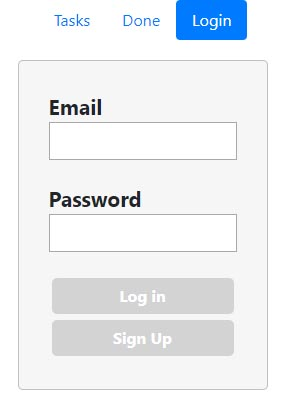
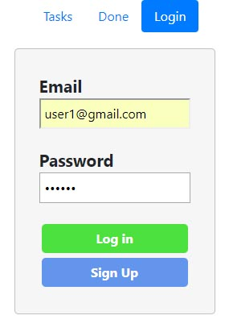
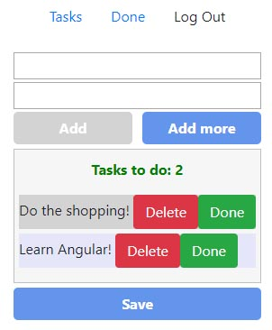
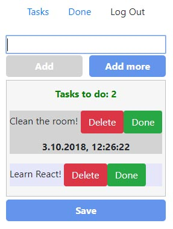
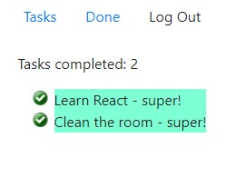

# to-do-list-Angular
Application allowing users to manage their tasks to be done.

# General description

# Purpouse and technology

# Installation

# File structure

# Application preview

Screens below represents application general look.

## Login screen

Login screen look changes depending on form validation.

## Tasks list screen

Tasks list changes depending on form validation and added tasks.

## Tasks done list

Very simple component listing tasks marked as done.

